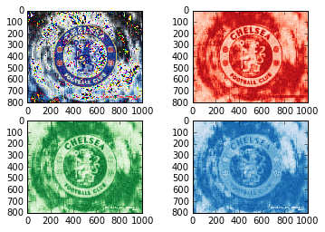
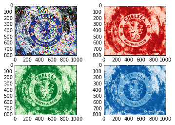

UECM3033 Assignment #2 Report
========================================================

- Prepared by: ** Tham Kien Yang**
- Tutorial Group: T3

--------------------------------------------------------

## Task 1 --  $LU$ Factorization or SOR method

The reports, codes and supporting documents are to be uploaded to Github at: 

[https://github.com/ThamKienYang/UECM3033_assign2](https://github.com/ThamKienYang/UECM3033_assign2)

Explain your selection criteria here.

In this assignment, i prefer to use LU method. This is because SOR method is more likely to be used in sparse matrix since sparse matrix has more zero elements.In this assignment, the non zero elements are the most in the matrices. 

Explain how you implement your `task1.py` here.

First, the function for LU decomposition is first done to A matrix. Then only the LU method is done for new A matrix and b matrix with a new function. Another function with SOR method is set with omega 1.03 and iteration limit is set to 10 to avoid infinite loop. Another function is set with condition if the nonzero elements more than the length of matrix A, then LU method is used or otherwise with SOR method.

---------------------------------------------------------

## Task 2 -- SVD method and image compression

Put here your picture file (chelsea.png)

How many non zero element in $\Sigma$?

The non zero elements in Sigma are  800  for red,  800  for green and  800  for blue with total of 2400.

Put here your lower and better resolution pictures. Explain how you generate
these pictures from `task2.py`.

I first created a function called picture_compress. In the function, i first create a shallow copy the previous sigma so that no influence on the previous value. Then i put an unknown k on the shallow copy of sigma so that k of non zero elements are remained and the rest is put to zero. Next the dimension of the matrix was changed to do dot multiplication of the formula.

 picture above was plotted using k = 30.

The above picture was plotted using k = 200.

What is a sparse matrix?

Sparse matrix is a matrix with relatively more zero elements or most of the elements are zero. Sparse matrix will have better compression ratio since it has more zero elements that may make it easier to be compressed. This is showed during the dot multiplication of this assignment. With more zero elements, it is more efficient.

-----------------------------------

last modified: 10/3/2016
